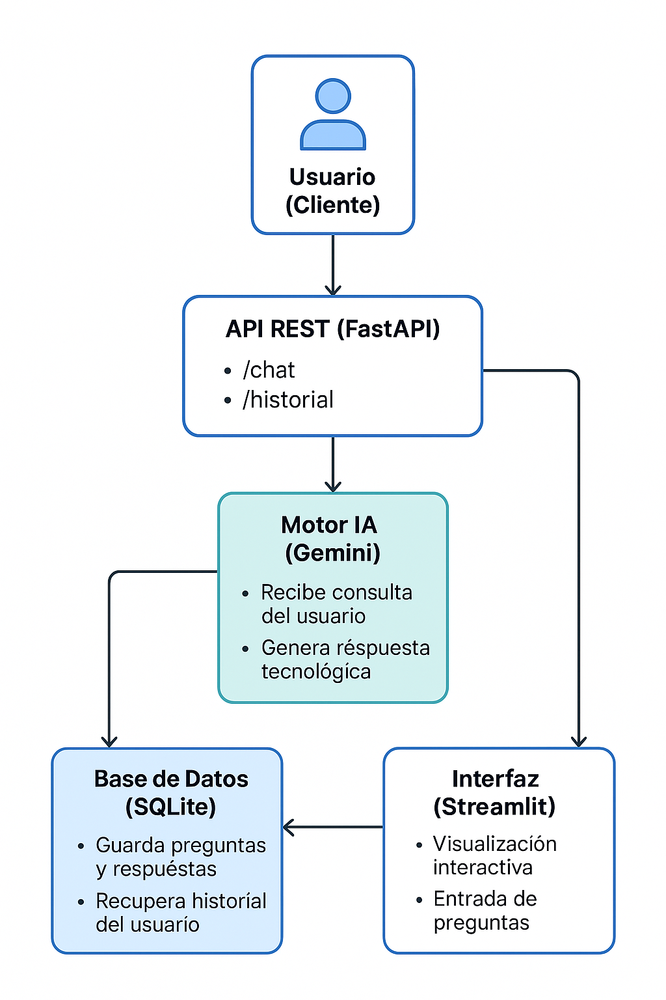

# 🚀 Echo: Chatbot de Tecnologías Futuras

Echo es un asistente experto en tecnología e innovación, diseñado para responder preguntas relacionadas con avances digitales y conceptos tecnológicos. Se basa en la API de **Google Gemini** y está implementado usando **FastAPI** y **Streamlit**.

## 📌 Características

✅ **Interfaz API REST** con **FastAPI** para obtener respuestas a consultas tecnológicas.  
✅ **Persistencia de datos** con **SQLite**, registrando preguntas y respuestas.  
✅ **Historial de conversaciones** accesible vía endpoint.  
✅ **Interfaz visual** con **Streamlit**, ofreciendo una experiencia amigable.  
✅ **Dockerización** para fácil despliegue con contenedores.  

## ⚙️ Instalación y Ejecución

### 1️⃣ Clona el repositorio  
```bash
git clone https://github.com/Cristianvas198/Echo
cd echo-chatbot
```

### 2️⃣ Configura variables de entorno  
Crea un archivo `.env` y añade tu clave de API de Google Gemini:  
```plaintext
GOOGLE_API_KEY=tu-clave-aqui
```

### 3️⃣ Construye y ejecuta el contenedor Docker  
```bash
docker build -t echo-chatbot .
docker run -p 8000:8000 -p 8501:8501 echo-chatbot
```

## 🛠️ Endpoints de la API

### 🔹 Landing Page  
`GET /` → Mensaje de bienvenida con instrucciones de uso.  

### 🔹 Chatbot  
`GET /chat?usuario=<nombre>&prompt=<consulta>`  
Permite obtener respuestas relacionadas con tecnología.  

### 🔹 Historial de conversaciones  
`GET /historial?usuario=<nombre>`  
Devuelve las preguntas y respuestas previas registradas.  

## 🎨 Interfaz en Streamlit

Una vez ejecutado el contenedor, accede a la interfaz visual en:  
[http://localhost:8501](http://localhost:8501)  

## 🏗️ Arquitectura

El proyecto sigue la siguiente estructura:

```
📂 echo-chatbot/
 ├── 📂 src/              # Código fuente
 │   ├── app.py          # API con FastAPI
 │   ├── stream.py       # Interfaz con Streamlit
 │   ├── requirements.txt # Dependencias
 ├── 📂 docs/             # Recursos estáticos (logo, imágenes)
 ├── Dockerfile           # Configuración del contenedor
 ├── .env                 # Variables sensibles
 ├── README.md            # Documentación del proyecto
```

## 📦 Imagen en DockerHub

Sube tu imagen a DockerHub para compartirla fácilmente:  
```bash
docker tag echo-chatbot tu-usuario/echo-chatbot
docker push tu-usuario/echo-chatbot
```

## 👨‍💻 Autor

**Cristian**  
📍 Madrid, España  
www.linkedin.com/in/cristiangvm98

🚀 Apasionado por la tecnología y la innovación.  

---
